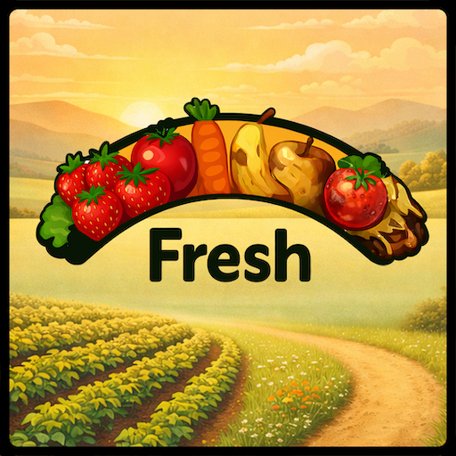

# Fresh (In Development)

Fresh adds shelf life to your produce and bales - crops age over time and will spoil if not sold or used!

## Why Fresh?

Vanilla FS25 lets you stockpile goods indefinitely, waiting for the perfect price. Fresh changes the game:

- **Strategic timing**: Sell before goods expire or lose everything
- **Active management**: Check ages, prioritize older stock
- **Realistic farming**: Real farms don't have infinite shelf life

Fresh tracks your goods using a batch system - each harvest or production run is tracked separately with its own age. Oldest stock expires first (FIFO), just like real inventory management.

## Development Status

**Current Phase:** Alpha 3 (Pallets, Bales & Object Storage)

### What's Working

- Pallet tracking for 100 product types across 10 categories
- Bale tracking for 4 forage types (grass, hay, straw, silage)
- Expiry display when looking at pallets or bales ("Expires in: X days")
- Warning indicator when produce or bales near expiration
- Automatic removal of expired goods with notification
- Fermenting bales (wrapped grass) age after fermentation completes
- Object storage persistence (pallets and bales continue aging in storage)
- Storage HUD shows expiring item counts with warning highlight
- Oldest items retrieved first from storage (FIFO)
- Multiplayer synchronization
- Savegame persistence

### In Progress

- Bulk support (trailers, silos, tanks, etc)

### Planned

- Placeable storage tracking
- Transfer chain (age flows between containers)
- Production integration

## Want to Help?

The mod is not ready for public testing yet, but if you're interested in testing beta builds when they are available join the discord channel #fs25_fresh on server https://discord.gg/KXFevNjknB 

---

*Fresh: Because hoarding should have consequences.*
